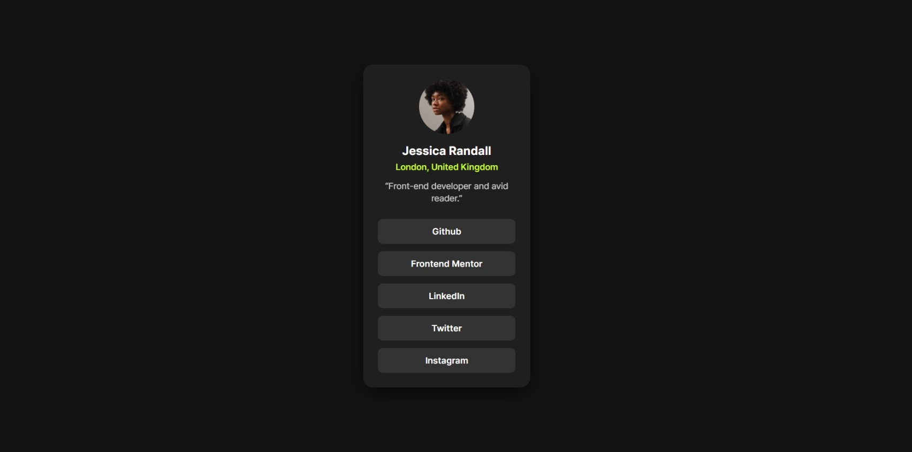

<h1>⚔️ Frontend Mentor – Social Links Profile</h1>

This is my solution to the Social Links Profile challenge from <a href="https://www.frontendmentor.io/challenges/social-links-profile-UG32l9m6dQ">Frontend Mentor.</a>

---

<h2>📌 Overview</h2>

<h3>The Challenge</h3>

"Your challenge is to build out this social links profile and get it looking as close to the design as possible.

You can use any tools you like to help you complete the challenge. So if you've got something you'd like to practice, feel free to give it a go.

Your users should be able to: See hover and focus states for all interactive elements on the page."

---

<h3>Screenshot</h3>

Project preview:



---

<h3>Links</h3>

- Solution URL: https://www.frontendmentor.io/solutions/social-links-profile-built-with-html-and-css--Aw7-78kwc
- Live Site URL: https://neelpatra.github.io/social-links-profile/

---

<h2>📋 My Process</h2>

<h3>Built with</h3>

- Semantic HTML5
- CSS custom properties (CSS variables)
- Flexbox
- Mobile-first workflow
- Custom fonts (Inter-static & variable font handling)
- Accessible focus states (<code>:focus-visible</code>)

<h3>What I learned</h3>

- How to center a layout both horizontally and vertically using CSS flexbox
- Proper use of CSS custom properties for theme colors
- The difference between static and variable fonts
- How to correctly map <code>font-weight</code> values to different font files
- How and why to use <code>:focus-visible</code> for accessibility instead of only <code>:hover</code>
- Debugging CSS issues using browser DevTools

```css
.links a:focus-visible {
  outline: 2px solid var(--green);
  outline-offset: 2px;
}
```
This ensures keyboard users get visible focus styles without affecting mouse users.

<h3>Useful Resources</h3>

- <a href="https://developer.mozilla.org/en-US/docs/Web/CSS/Reference/Properties/--*">MDN - CSS Custom Properties</a>
- <a href="https://www.w3schools.com/html/">W3Schools - HTML</a>
- <a href="https://www.w3schools.com/css/">W3Schools - CSS</a>

---

<h2>🙏 Acknowledgements</h2>
Thanks to the Frontend Mentor for providing the design and challenges, that helped clarify layouts, fonts, and accessibility best practices.
